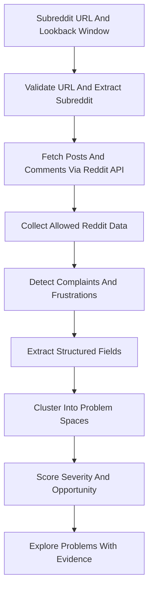

# Problem Finder Plan

## Core Concept

Build a problem discovery engine for people who want to find real startup opportunities from what actual people are complaining about publicly.

The product should not start by narrowing to a vertical. Its value is broad scanning across real human discussion. The first version should concentrate on Reddit: the user provides a subreddit link, chooses how far back to analyze, and the system uses Reddit's API to collect complaints, frustrations, workarounds, repeated questions, and unmet needs from that subreddit. It then normalizes them into structured problem clusters with severity and opportunity signals.

One-liner:

> Find real problems worth solving by analyzing what people publicly complain about on Reddit.

## Main User

The primary user is a founder, builder, researcher, or curious operator looking for gaps in society that could become startup ideas.

They are asking:

- What are people repeatedly frustrated by?
- How painful is the issue?
- Who has the problem?
- What are they trying today instead?
- Is this a one-off annoyance or a repeated pattern?
- Are people already spending money, time, or effort to solve it?
- What startup ideas could address the gap?

## Recommended Direction

Start as a problem-finding research tool, not a startup idea generator.

The system should emphasize evidence first, then interpretation. The user should be able to inspect raw complaints and decide whether a problem is worth exploring. Auto-generated startup ideas can exist, but they should be secondary to problem validation.

The strongest version ranks problem clusters by severity using signals like:

- Complaint frequency.
- Emotional intensity.
- Time or money wasted.
- Failed existing solutions.
- Repeated workaround behavior.
- Urgency or consequence of the problem.
- Source diversity.
- Recency and growth.
- Whether the person sounds willing to pay for relief.

## Product Workflow

1. User enters a Reddit subreddit URL, such as `https://www.reddit.com/r/cursor/`.
2. User chooses a lookback window, such as 7 days, 30 days, or 90 days.
3. The system validates the URL and extracts the subreddit name.
4. The system uses Reddit's API to fetch public posts and relevant comments from that subreddit within the requested lookback window.
5. Detect complaint-like content: frustration, unmet need, broken workflow, workaround, recurring question, negative review, or request for help.
6. Extract structured fields from each complaint.
7. Cluster similar complaints into broader problem spaces.
8. Score each problem by severity and opportunity potential.
9. Show evidence, summaries, personas, existing alternatives, and possible solution directions.

## Data Model

Each analysis run should preserve:

- Subreddit URL.
- Subreddit name.
- Requested lookback window.
- Fetch timestamp.
- Reddit API pagination or cursor metadata if needed.
- Count of posts and comments fetched.
- Count of complaint-like items detected.

Each raw complaint should preserve:

- Raw text.
- Reddit post or comment URL.
- Subreddit.
- Timestamp.
- Post title when available.
- Parent thread context when useful.
- Product, service, institution, workflow, or life area mentioned.
- Persona or affected user type if inferable.
- Complaint category.
- Severity indicators.
- Existing workaround or failed solution.
- Desired outcome.

Each problem cluster should include:

- Plain-language problem statement.
- Representative evidence snippets.
- Affected personas.
- Frequency and growth.
- Severity score.
- Opportunity score.
- Existing solutions people mention.
- Why current solutions appear insufficient.
- Suggested discovery questions for talking to real users.

## Approach

Recommended: Evidence-first problem search engine.

This is the best fit for your idea. It keeps the domain open, preserves raw Reddit evidence, and lets users explore society-wide pain points without pretending every complaint is a startup. It can later add more platforms, dashboards, alerts, and reports.

The first interaction should be simple:

- Paste a subreddit URL.
- Pick a lookback window.
- Run analysis.
- Review ranked problem clusters with raw Reddit evidence.

## What Makes The Idea Good

The idea is promising because startup discovery often starts from founder intuition, not systematic evidence. Public complaints are messy, but they are closer to real pain than generic trend reports or idea lists.

The strongest insight is that complaints are not the product. Structured, scored, evidence-backed problem clusters are the product.

## Main Risks

The biggest risk is noise. People complain about many things that are not startup opportunities.

Other risks:

- Public data may be biased toward loud users.
- Reddit data may overrepresent specific demographics, communities, and internet-native problems.
- Reddit access, storage, scraping, API usage, and resale must follow Reddit's current terms and technical limits.
- Reddit API rate limits, authentication, pagination, deleted content, and comment depth limits may affect coverage.
- Severity is hard to infer reliably from text alone.
- Broad search can become overwhelming without strong ranking.
- Generated summaries can hide important nuance unless raw evidence is always visible.
- A problem may be severe but not monetizable or solvable by a startup.

## How To Reduce Risk

Start with a Reddit API prototype before building heavy infrastructure.

- Support one subreddit URL and one lookback window at a time.
- Fetch recent posts and comments through Reddit's API.
- Collect Reddit complaints from a few varied subreddits across domains.
- Normalize them into structured fields.
- Cluster them into problem spaces.
- Create a severity scoring rubric.
- Review whether top-ranked problems feel meaningfully better than random browsing.
- Use the output to pick 5-10 problems for real user discovery interviews.

The validation question is:

> Does this help someone find better problems faster than browsing Reddit manually?

## MVP Scope

A good Reddit-first MVP should include:

- Input for a subreddit URL.
- Lookback selection, starting with 7 days as the simplest default.
- Reddit API ingestion for posts and relevant comments in that window.
- Problem clusters instead of isolated posts.
- Severity and opportunity scoring.
- Raw evidence for every summary.
- Filters by subreddit, persona, domain, severity, recency, and workaround.
- A “why this might be worth solving” explanation.
- Discovery prompts for validating the problem with real people.

Avoid initially:

- Fully automated startup plans.
- Real-time ingestion from every platform.
- Multi-platform ingestion before Reddit proves useful.
- Bulk analysis across many subreddits before single-subreddit analysis works well.
- Complex market sizing.
- Claims that a problem is definitely a business opportunity.
- Black-box rankings without evidence.

## Pivot Options If The Broad Product Is Too Noisy

If broad scanning becomes too noisy, pivot to one of these without abandoning the core idea:

- Problem search engine: user searches any topic and gets structured complaints and problem clusters.
- Weekly problem brief: curated severe problems discovered across the internet.
- Founder research assistant: user enters a domain, and the tool returns complaints, personas, alternatives, and interview questions.
- Gap detector: compare complaints against existing solutions to find underserved needs.

## Next Best Step

Create a small Reddit API evidence pack before building the full product.

Use a subreddit such as `https://www.reddit.com/r/cursor/` with a 7-day lookback window. Fetch posts and relevant comments through Reddit's API, structure the complaint-like items, cluster them, and score them. If the resulting top problem clusters feel more useful than browsing the subreddit manually, expand to more subreddits and later add more data sources.