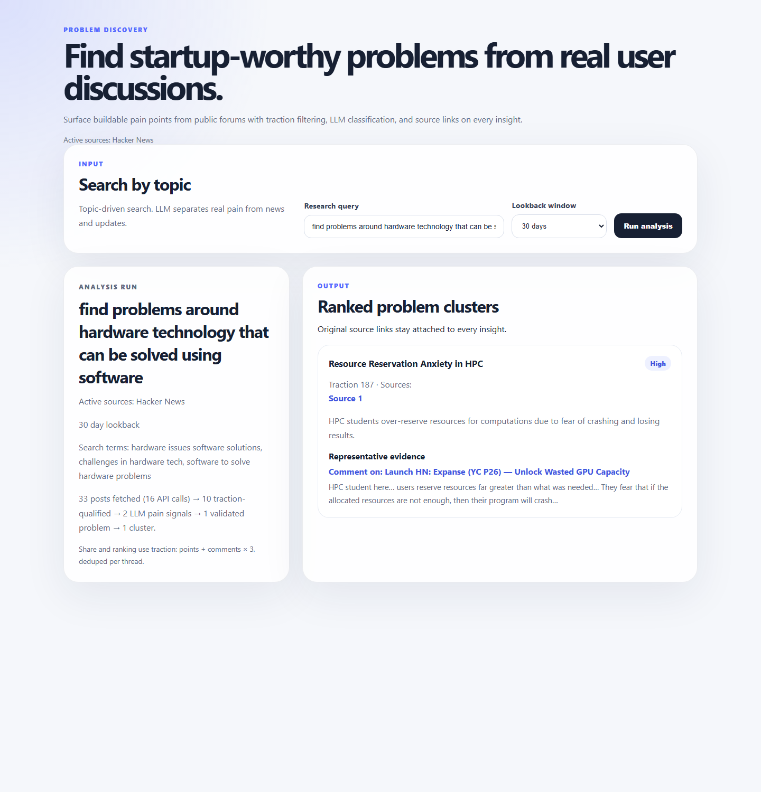
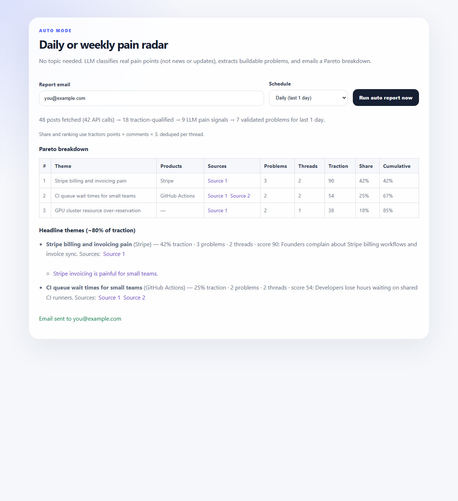

# Problem Finder

Find startup-worthy pain points from public forum discussions. This MVP focuses on **Hacker News**: it fetches recent threads, filters by traction, uses LLMs to separate real pain from news, clusters themes, and can email a daily Pareto-style digest.

## Features

- **Search by topic** — natural-language research queries with HN search expansion
- **Auto mode** — broad pain discovery across HN without a topic
- **Daily email digest** — previous day's top problem themes (Vercel Cron)
- **Source links** — every cluster links back to original HN threads

## Example

### Search by topic

30-day lookback — input query, pipeline stats, and ranked cluster with HN source links:



*Query:* `find problems around hardware technology that can be solved using software`  
*Result:* 33 posts → 1 validated problem → **Resource Reservation Anxiety in HPC** (traction 187, severity High)

> Use a **30–90 day** lookback for broad topics. A 7-day window often returns no posts.

### Auto mode

No topic — scans HN for the last 24 hours, builds a Pareto table, and emails the digest:



*Schedule:* Daily (last 1 day) · Pareto-ranked themes with source links · email on completion

To regenerate screenshots after UI changes:

```bash
node scripts/capture-readme-screenshot.mjs
```

## Stack

- Next.js 16 (App Router), TypeScript, React 19
- OpenAI (`gpt-4o-mini`) for classification, extraction, clustering
- [HN Algolia Search API](https://hn.algolia.com/api) + [HN Firebase API](https://github.com/HackerNews/API)
- [Resend](https://resend.com) for email
- [Vercel](https://vercel.com) for hosting and cron

## Quick start (local)

```bash
git clone https://github.com/K-bhuvan/ProblemFinder.git
cd ProblemFinder
npm install
cp .env.example .env.local
# Fill in OPENAI_API_KEY, RESEND_API_KEY, AUTO_REPORT_EMAIL, CRON_SECRET
npm run dev
```

Open [http://localhost:3000](http://localhost:3000).

> **Tip:** Run `npm run dev` from **Windows PowerShell** or native Linux — not WSL on `/mnt/c/` — to avoid Next.js path/cache issues on Windows.

## Environment variables

Copy `.env.example` to `.env.local` and set:

| Variable | Required | Description |
|----------|----------|-------------|
| `OPENAI_API_KEY` | Yes | OpenAI API key |
| `AUTO_REPORT_EMAIL` | For email | Digest recipient |
| `AUTO_REPORT_FREQUENCY` | No | `daily` (default) or `weekly` |
| `RESEND_API_KEY` | For email | Resend API key |
| `RESEND_FROM_EMAIL` | For email | Verified sender (sandbox: `onboarding@resend.dev`) |
| `CRON_SECRET` | For cron | Random string ≥16 chars; Vercel sends this as `Authorization: Bearer …` |
| `HN_*`, `MIN_TRACTION_*` | No | Fetch and ranking thresholds (see `.env.example`) |

## Deploy to Vercel (free tier)

### What works on Hobby (free)

| Feature | Free tier |
|---------|-----------|
| Hosting the web UI | Yes |
| Serverless API routes | Yes (10s default, **up to 60s** with `maxDuration`) |
| **Cron jobs** | **Once per day** only |
| Cron timing precision | Within the scheduled **hour** (e.g. `0 13 * * *` runs between 13:00–13:59 UTC) |

Daily morning digests fit the free tier. Hourly cron requires [Vercel Pro](https://vercel.com/docs/cron-jobs/usage-and-pricing).

### Deploy steps

1. Push this repo to GitHub (do **not** commit `.env.local`).
2. [Import the project](https://vercel.com/new) into Vercel.
3. Add all environment variables from `.env.example` in **Project → Settings → Environment Variables**.
4. Generate a strong `CRON_SECRET` (password manager or `openssl rand -hex 32`).
5. Deploy. Vercel reads `vercel.json` and registers the cron job automatically.
6. Verify cron: **Project → Settings → Cron Jobs** should show `/api/cron/auto-report`.

### Daily email schedule

`vercel.json` runs the digest at **`0 13 * * *` (UTC)** — roughly **8–9 AM US Eastern**, depending on daylight saving.

The daily report uses a **1-day lookback** (`AUTO_REPORT_FREQUENCY=daily`), i.e. problems discussed in the previous ~24 hours.

To change the time, edit the cron `schedule` in `vercel.json` (UTC) and redeploy. [Cron expression reference](https://vercel.com/docs/cron-jobs#cron-expressions).

### Email setup (Resend)

1. Create a [Resend](https://resend.com) account.
2. **Sandbox:** `onboarding@resend.dev` only delivers to your Resend signup email.
3. **Production:** [Verify a domain](https://resend.com/domains), set `RESEND_FROM_EMAIL` to e.g. `reports@yourdomain.com`.

### Test cron locally

Cron routes are normal HTTP endpoints:

```bash
curl -H "Authorization: Bearer YOUR_CRON_SECRET" http://localhost:3000/api/cron/auto-report
```

### Timeout note

Auto reports run several LLM steps and can take **30–90 seconds**. API routes set `maxDuration = 60` (Hobby max). If cron times out on free tier, lower `HN_MAX_REQUESTS_PER_RUN` or upgrade to Pro (300s max).

## Scripts

```bash
npm run dev      # local dev (webpack)
npm run build    # production build
npm run test     # vitest
npm run lint     # eslint
```

## API routes

| Route | Method | Purpose |
|-------|--------|---------|
| `/api/analyze` | POST | Manual topic analysis |
| `/api/auto-report` | POST | Trigger digest from UI |
| `/api/cron/auto-report` | GET | Scheduled digest (requires `CRON_SECRET`) |

## Security note for public deployments

`/api/analyze` and `/api/auto-report` are **unauthenticated** so the UI works out of the box. Anyone who finds your URL can trigger OpenAI usage. Mitigations:

- Use [Vercel Deployment Protection](https://vercel.com/docs/security/deployment-protection) for a private preview
- Monitor OpenAI usage and set billing limits
- Fork and add your own API key middleware if needed

The cron endpoint **is** protected by `CRON_SECRET`.

## Attribution

Discussion data comes from [Hacker News](https://news.ycombinator.com). This project is **not affiliated with Y Combinator** or Hacker News.

- Every insight links back to the original `news.ycombinator.com` thread
- Do not use HN or YC logos to imply endorsement
- See [LEGAL.md](./LEGAL.md) for full data-use notes

## Legal & data use

See [LEGAL.md](./LEGAL.md) for HN API usage, attribution, email compliance, and LLM disclaimers.

## License

[MIT](./LICENSE)
